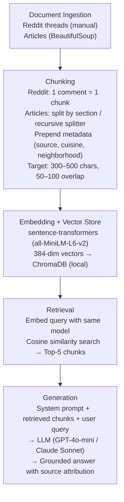

# Project 1 Planning: The Unofficial Guide

> Write this document before you write any pipeline code.
> Your spec and architecture diagram are what you'll use to direct AI tools (Claude, Copilot, etc.) to generate your implementation — the more specific they are, the more useful the generated code will be.
> Update the Retrieval Approach and Chunking Strategy sections if you change your approach during implementation.
> Update this file before starting any stretch features.

---

## Domain
My domain is restaurants in Baltimore. Deciding on where to eat is often not easy and searches for the best restaurants frequently produce long articles or tons and tons of recommendations. Furthermore, finding the perfect restaurant for a specific cuisine or under special conditions (vegan, budget friendly, date night, etc.) is even harder. While this information exists, it is scattered across articles, food reviews, and reddit threads.

<!-- What domain did you choose? Why is this knowledge valuable and hard to find through official channels? -->

---

## Documents

<!-- List your specific sources: URLs, subreddit names, forum threads, or file descriptions.
     Aim for at least 10 sources that together cover different subtopics or perspectives within your domain. -->

| # | Source | Description | URL or location |
|---|--------|-------------|-----------------|
| 1 | Reddit | Restaurant Recommendations for Chef| https://www.reddit.com/r/baltimore/comments/1e1reaf/restaurant_recommendations_needed_for_my_visiting/ |
| 2 | Reddit | Fine Dining Recommendations| https://www.reddit.com/r/baltimore/comments/1q0mh87/fine_dining_recs/|
| 3 | Reddit | Underrated Restaurants | https://www.reddit.com/r/baltimore/comments/1mp82pl/what_restaurant_in_baltimore_doesnt_get_much_hype/ |
| 4 | Reddit | Best Dinner Spots| https://www.reddit.com/r/baltimore/comments/1tbc2re/best_dinner_spots/|
| 5 | Reddit | Best Restaurants | https://www.reddit.com/r/baltimore/comments/1rl39z1/best_restaurants_in_baltimore/ |
| 6 | Reddit | Mexican Restaurants | https://www.reddit.com/r/baltimore/comments/1tf9p5q/striking_out_on_google_anyone_know_any_mexican/ |
| 7 | Reddit | Dinner with Kids | https://www.reddit.com/r/baltimore/comments/1nekd3b/best_place_to_grab_dinner_with_kids_innear_fells/|
| 8 | Reddit | Jamaican Restaurants | https://www.reddit.com/r/baltimore/comments/1rxh8ur/what_are_the_best_jamaican_restaurants/ |
| 9 | Reddit | Michelin Worthy Restaurants| https://www.reddit.com/r/baltimore/comments/1qomnti/who_are_your_michelin_worthy_restaurants_in_the/|
| 10 | DC Eater| Essential Restaurants| https://dc.eater.com/maps/best-bars-restaurants-bakeries-baltimore-dining-guide-38|
| 11 | Baltimore Magazine | Best Restaurants 2026 | https://www.baltimoremagazine.com/section/fooddrink/best-restaurants-baltimore-2026/ |
| 12 | The Baltimore Banner| Chef Recommendations| https://www.thebanner.com/culture/food-drink/baltimore-county-chefs-restaurant-recommendations-OCJ2TU5XL5AMXJDWUUFJ2LRLRU/ |
| 13 | Like the Tea Eats| Best Restaurants by Neighborhood| https://liketheteaeats.com/best-baltimore-restaurants/ |
| 14 | Baltimore Website| Waterfront Dining | https://baltimore.org/what-to-do/where-to-eat/waterfront-dining-in-baltimore/|
| 15 | Baltimore Website| Best Seafood| https://baltimore.org/what-to-do/where-to-find-baltimores-best-seafood/|
| 16 | Reddit | Seafood | https://www.reddit.com/r/baltimore/comments/18jrk5j/best_seafood_in_town/ |
| 17 | Reddit | Italian | https://www.reddit.com/r/baltimore/comments/1l6evp0/authentic_italian_food/|
| 18 | Reddit | Ethiopian | https://www.reddit.com/r/baltimore/comments/1fzyxf8/ethiopian_recommendations/|
| 19 | Reddit | Asian/Asian Fusion | https://www.reddit.com/r/baltimore/comments/1mifzti/any_good_asianasian_fusion_spots/|
| 20 | Baltimore Website| Asian Owned Restaurants| https://baltimore.org/what-to-do/where-to-eat/asian-owned-restaurants-in-baltimore/|
| 21 | Baltimore Website| Vegan & Vegetarion| https://baltimore.org/what-to-do/vegetarian-vegan-restaurants-in-baltimore/|
| 22 | Baltimore Website| Budget Friendly | https://baltimore.org/what-to-do/where-to-eat/budget-friendly-baltimore-restaurants/|
| 23 | Baltimore Website| International Dining | https://baltimore.org/what-to-do/international-dining-in-baltimore/ |
| 24 | Baltimore Website| Breakfast & Brunch | https://baltimore.org/what-to-do/best-breakfast-and-brunch-spots-in-baltimore/|
| 25 | Baltimore Website| Crab Cakes | https://baltimore.org/what-to-do/where-to-eat/top-eateries-to-enjoy-authentic-baltimore-crab-cakes/|
| 26 | Baltimore Website| Date Night| https://baltimore.org/what-to-do/baltimores-date-night-destinations/|

---

## Chunking Strategy

<!-- How will you split documents into chunks?
     State your chunk size (in tokens or characters), overlap size, and explain why those
     numbers fit the structure of your documents.
     A review-heavy corpus warrants different chunking than a long FAQ. -->

Chunking strategy will be recursive for the articles since the reviews are mainly split up by restaurant. Recursive
chunking can split the sections cleaning (splitting on \n\n, \n, and .) with a 300–500 character target and 50–100 character overlap will be used as a fallback. Reddit threads are typically short sentences, so each comment can be treated as its own chunk. Appending metadata such as restaurant name, location, cuisine also helps with context.

**Chunk size:** 300-500 characters

**Overlap:** 50-100 characters 

**Reasoning:** Restaurant reviews often very long and a lot of information can be packed into just a few sentences.

---

## Retrieval Approach

<!-- Which embedding model are you using (e.g., all-MiniLM-L6-v2 via sentence-transformers)?
     How many chunks will you retrieve per query (top-k)?
     If you were deploying this for real users and cost wasn't a constraint, what tradeoffs
     would you weigh in choosing a different embedding model — context length, multilingual
     support, accuracy on domain-specific text, latency? -->

**Embedding model:** all-MiniLM-L6-v2 via the sentence-transformers library

**Top-k:** 3 chunks per query, giving the LLM balance of context without the irrelevant results

**Production tradeoff reflection:** If this project was for real users, a model that might be better is OpenAI's text-embedding-3-large. It has higher dimensional embedings, but the tradeoff is higher cost and dependency on an external API.

---

## Evaluation Plan

<!-- List your 5 test questions with their expected correct answers.
     Questions should be specific enough that you can judge whether the system's response
     is right or wrong. "What are good dining halls?" is too vague.
     "What do students say about wait times at [dining hall name] during lunch?" is testable. -->

| # | Question | Expected answer |
|---|----------|-----------------|
| 1 | Where can I get the best crab cakes in Baltimore?| Should recommend a well-known crab cake spots from the baltimore.org (#25) and Reddit seafood (#16) sources (Faidley's, Jimmy's Famous Seafood, Thames Street Oyster House) |
| 2 | What are some good restaurants in Baltimore for a date night? | Should pull from the date night source (#26) and fine dining Reddit thread (#2), recommending places known for ambiance and upscale dining (The Food Market, Cinghiale, Charleston)|
| 3 | Where can I find good budget-friendly dinner food in Baltimore?| Should retrieve from the budget-friendly source (#22) and  recommend affordable options (Ekiben, The Empanada Lady, Johnny Rad’s, Little Donna’s). Should not suggest fine dining or expensive spots.|
| 4 | What are the best Ethiopian restaurants in Baltimore?| Should retrieve from the Ethiopian Reddit thread (#18) and possibly the international dining source (#23), naming specific Ethiopian restaurants (Dukem, The Ethiopian Place, Lalibela)|
| 5 | What's a good family-friendly restaurant near Fells Point for dinner with kids?| Should retrieve from the dinner with kids thread (#7) specifically and possibly the neighborhood guide (#13), recommending kid-friendly spots in or near Fells Point (Koopers,Alexander's Tavern,Broadway Market)|

---

## Anticipated Challenges

<!-- What could go wrong? Name at least two specific risks with reasoning.
     Consider: noisy or inconsistent documents, missing source attribution, off-topic
     retrieval, chunks that split key information across boundaries. -->

1. Dealing with noisy reddit data. Reddit comments can contain many recommendations in one post, or have many posts simply agreeing with a previous comment. It could miss out on important factors like the location/cuisine/cost of a restaurant that often would be mentioned in a proper review. Therefore it could be difficult to retrieve the proper chunks despite the information being in the data. 

2. Some of the information may not be up to date. I tried to pull articles and threads from the last few years, but in the 
restaurant business, a year or two could mean a restaurant is no longer open, under new management, or no longer the favorite
it once was. Ultimately, this is a sourcing issue. 

---

## Architecture

<!-- Draw a diagram of your pipeline showing the five stages:
     Document Ingestion → Chunking → Embedding + Vector Store → Retrieval → Generation
     Label each stage with the tool or library you're using.
     You can use ASCII art, a Mermaid diagram, or embed a sketch as an image.
     You'll use this diagram as context when prompting AI tools to implement each stage. -->

---

## AI Tool Plan

<!-- For each part of the pipeline below, describe:
     - Which AI tool you plan to use (Claude, Copilot, ChatGPT, etc.)
     - What you'll give it as input (which sections of this planning.md, which requirements)
     - What you expect it to produce
     - How you'll verify the output matches your spec

     "I'll use AI to help me code" is not a plan.
     "I'll give Claude my Chunking Strategy section and ask it to implement chunk_text()
     with my specified chunk size and overlap" is a plan. -->

**Milestone 3 — Ingestion and chunking:**
Input: I'll provide Claude with the Documents table, the Chunking Strategy section, and the Architecture diagram. I'll ask it to generate: 

1. A scraping/ingestion script that fetches each source URL and saves clean text, handling Reddit threads (extracting individual comments) differently from articles (extracting the full article body) 

2. A chunk_documents() function that takes the cleaned text and splits it according to my chunking strategy, no splitting for Reddit comments and section-based or recursive splitting for articles, with metadata prepended to each chunk.

Expected output: Two Python scripts for scraping/cleaning and chunking that produce a list of chunk dictionaries with text, source, cuisine_category, and neighborhood fields.

Verification: I'll run the scripts on 3–4 sources manually and inspect the output chunks to confirm that Reddit comments are kept whole, articles are split at restaurant boundaries, metadata is prepended, and no chunk exceeds the 500-character target.

**Milestone 4 — Embedding and retrieval:**

Input: I'll provide the Retrieval Approach section and the Architecture diagram. I'll ask Claude to implement an embed_and_store() function that takes my chunked documents, embeds them with all-MiniLM-L6-v2, and stores them in ChromaDB with metadata and a retrieve() function that takes a user query, embeds it, and returns the top-5 most similar chunks.

Expected output: A retrieval.py module with both functions, using sentence-transformers and chromadb as dependencies.

Verification: I'll run my 5 evaluation questions through retrieve() and manually check that the returned chunks are relevant. For example, the Ethiopian restaurant query should return chunks from source #18 and #23, not random seafood recommendations.

**Milestone 5 — Generation and interface:**

Input: I'll provide the full Architecture diagram and Evaluation Plan. I'll ask Claude to implement a generate_answer() function that takes a user query, calls retrieve() to get top-5 chunks, formats them into a prompt with a system message instructing the LLM to only answer from provided context and cite sources, and returns the generated answer. I'll also ask for a simple CLI or Gradio interface to interact with the pipeline.

Expected output: A generate.py module and a main.py entry point that lets me type a question and get a grounded answer with source citations.

Verification: I'll run all 5 evaluation questions and compare the generated answers against my expected answers in the Evaluation Plan. I'll specifically check that the system does not hallucinate restaurants not mentioned in any source, and that it attributes recommendations to the correct source.